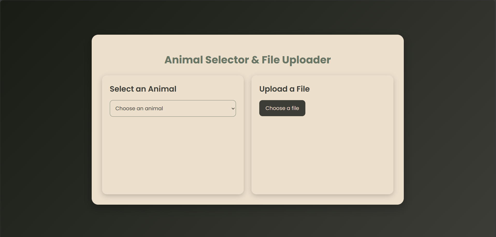

# Animal Selector & File Uploader

A modern web application that allows users to view animal images from a predefined collection and upload files. Built with Flask, JavaScript, and styled with custom CSS.

<p align="center">
  
</p>

## Features

- **Animal Image Viewer**
  - Select animals from a dropdown menu
  - View images of selected animals in real-time
  - Smooth animations and transitions
  - Responsive image container

- **File Upload System**
  - Drag and drop file upload capability
  - Instant file information display
  - Shows file name, size, and type
  - Modern UI with hover effects

## Tech Stack

- **Backend**: Python/Flask
- **Frontend**: HTML5, CSS3, JavaScript
- **Styling**: Custom CSS with gradient backgrounds and animations

## Prerequisites

- Python 3.6 or higher
- Flask
- Modern web browser
- Internet connection (for font loading)

## Installation

1. Clone the repository:
```bash
git clone https://github.com/yourusername/animal-selector-uploader.git
cd animal-selector-uploader
```

2. Create and activate a virtual environment (optional but recommended):
```bash
python -m venv venv
source venv/bin/activate  # On Windows use: venv\Scripts\activate
```

3. Install required dependencies:
```bash
pip install flask
```

4. Set up the images folder:
   - Create a `static/images` folder
   - Add animal images with corresponding names (e.g., `cat.jpg`, `dog.jpg`, `elephant.jpg`)

## Project Structure
```
animal-selector-uploader/
├── static/
│   ├── images/
│   │   ├── cat.jpg
│   │   ├── dog.jpg
│   │   └── elephant.jpg
│   ├── script.js
│   └── styles.css
├── templates/
│   └── index.html
├── app.py
└── README.md
```

## Usage

1. Start the Flask server:
```bash
python app.py
```

2. Open your web browser and navigate to:
```
http://localhost:5000
```

3. Use the application:
   - Select an animal from the dropdown to view its image
   - Click "Choose a file" to upload and view file information

## Features in Detail

### Animal Image Viewer
- Fetches images dynamically using AJAX
- Base64 image encoding for secure transfer
- Smooth transitions between image changes
- Error handling for missing images

### File Upload System
- Real-time file information display
- Supports various file types
- File size calculation in MB
- Responsive design for all screen sizes

## Styling

The application features a modern design with:
- Gradient backgrounds
- Smooth hover animations
- Shadow effects for depth
- Responsive layout
- Custom font (Poppins) integration

## API Endpoints

- `GET /`: Main application page
- `GET /get_animal_image/<animal>`: Retrieve animal image
- `POST /upload_file`: Handle file uploads

## License

This project is licensed under the MIT License - see the LICENSE file for details.

## Acknowledgments

- Font by Google Fonts (Poppins)
- Inspiration from modern UI/UX designs
- [colorhunt](https://colorhunt.co/) for themes